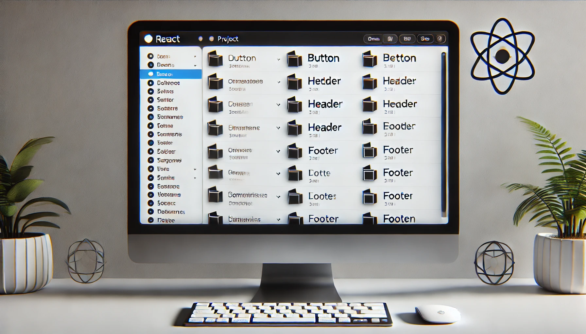

import imageIsaacVianna from '@div/images/team/isaac-vianna.jpeg'
export const article = {
  date: '2024-12-27',
  title: 'A Quick Guide to Naming Components',
  description:
    'Practical guidelines for naming components in modern web development following industry best practices.',
  author: {
    name: 'Isaac Vianna',
    role: 'Senior Frontend Developer | CEO',
    image: { src: imageIsaacVianna },
  },
}

export const metadata = {
  title: article.title,
  description: article.description,
}

# A Quick Guide to Naming Components
<br />

Naming components is an essential skill for front-end developers, especially in projects that use frameworks like React. Good names make the code more readable, maintainable, and collaborative. On the other hand, poorly chosen names can cause confusion, hinder understanding, and compromise the scalability of the project.
<br />

In this article, we will present best practices and strategies that you can apply to name components efficiently, ensuring clarity and organization in your code.
<br />

---
<br />


## 1. Be Descriptive and Intuitive
<br />

A good component name should clearly describe what it does or represents. When creating a component, ask yourself: **"Does this name communicate its function to other developers?"**.  
<br />

- Use **nouns** for components that represent an entity (e.g., `Button`, `Card`, `Header`).  
- Use **verbs or verb phrases** for components that perform specific actions (e.g., `SubmitButton`, `FormHandler`).  
- Avoid abbreviations or generic names like `Comp`, `MyComponent`, or `Test`.  
<br />

Example of good usage:

## 2. Adopt Consistent Patterns
<br />

Maintaining consistency is essential for making the code understandable and easy to navigate. Choose a naming pattern and follow it throughout the project.  
<br />

Some examples of widely used patterns:  
- **PascalCase**: For React components (`UserCard`, `LoginForm`).  
- **camelCase**: For variables and helper functions (`handleClick`, `fetchData`).  
- **kebab-case**: For CSS classes (`button-primary`, `header-nav`).  
<br />

Example of consistency:
```jsx
// Correct
function ProductList() {
  return <div>Product List</div>;
}

// Incorrect
function product_list() {
  return <div>Product List</div>;
}
```
<br />

---
<br />

## 3. Use Prefixes for Organization
<br />

In larger projects, it's common to reuse components with similar functions in different contexts. Adding **prefixes** can help categorize components and avoid naming conflicts.  
<br />

Examples:  
- Functionality-based prefixes: `AuthLogin`, `AuthRegister` (authentication).  
- Layout-based prefixes: `DashboardSidebar`, `DashboardHeader`.  
- Reusability prefixes: `SharedButton`, `SharedModal`.  
<br />

This makes it easier to navigate the code and identify the component's purpose.
<br />

---
<br />



## 4. Avoid Redundant Context
<br />

Don't include unnecessary information in the component name, especially if the context is already clear. This makes the code cleaner and more readable.  
<br />

Example:
```jsx
// Correct
function Header() {
  return <header>Header</header>;
}

// Incorrect
function HeaderComponentForMainPage() {
  return <header>Header</header>;
}
```
<br />

If the component is inside a specific folder or module, avoid repeating the context in the name. For example:
```
components/
  Button/
    Button.jsx
    Button.styles.js
```
The name `Button` is already sufficient within the `Button/` directory.
<br />

---
<br />

## 5. Think About Scalability
<br />

When naming components, consider how the project might grow. Choose names that are flexible enough for future changes or expansions.  
<br />

For example:  
- Use specific names like `PrimaryButton` and `SecondaryButton` instead of just `Button1` or `Button2`.  
- Avoid names that describe the visual appearance of the component, like `BlueButton`, as this might change over time.
<br />

---
<br />

## 6. Document Your Decisions
<br />

Having documented conventions for component naming is crucial in teams or collaborative projects. Include this documentation in the project repository and encourage all team members to follow it.
<br />

Example topics to document:
- When to use compound names (e.g., `UserProfileCard`).  
- Guidelines for prefixes and suffixes.  
- Approaches for reusable and specific components.
<br />

---
<br />


## 7. Collaborate and Review
<br />

Component naming doesn't have to be a solitary task. In teams, discuss names during code reviews or during planning. Getting feedback ensures that the chosen names are clear for everyone.  
<br />

---
<br />

## Conclusion

<br />

Naming components might seem like a small detail, but it makes a big difference in code readability and maintenance. By following practices like being descriptive, consistent, and avoiding redundancies, you ensure that your project is organized and accessible to all developers.  
<br />

Adopt these strategies and try implementing a naming convention in your next projects. Well-named code is the first step towards more agile and collaborative development!
<br />