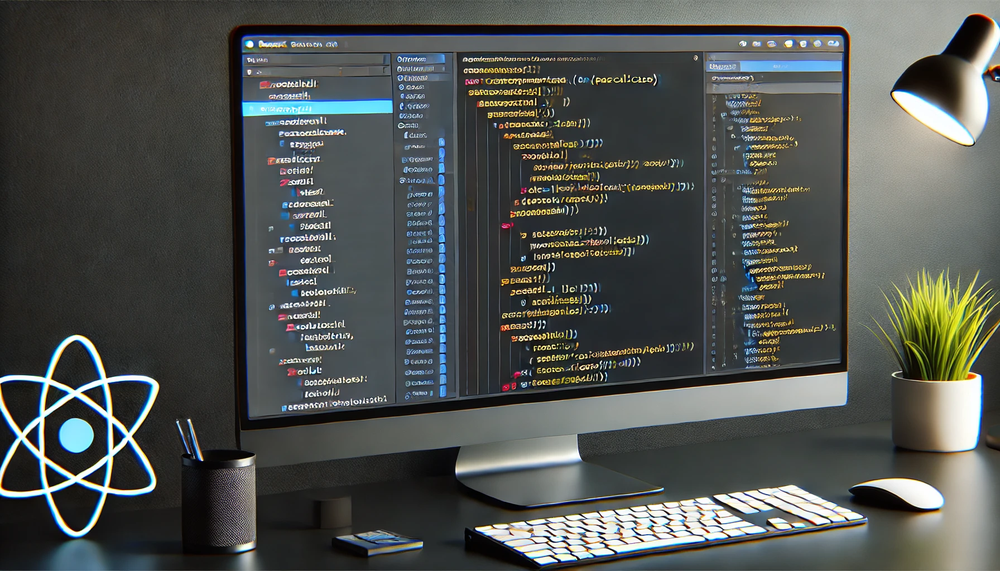
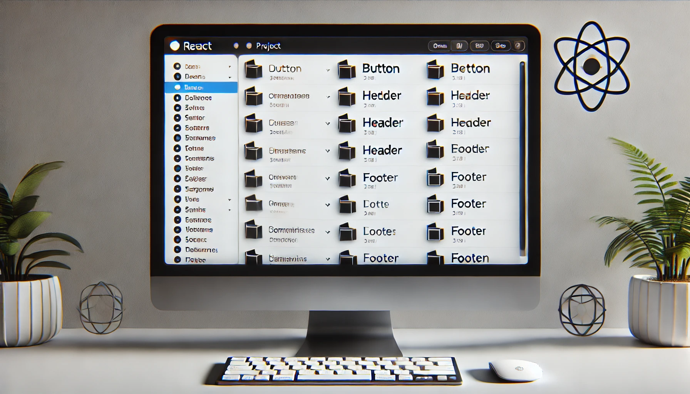

import imageIsaacVianna from '@div/images/team/isaac-vianna.jpeg'

export const article = {
  date: '2024-12-27',
  title: 'Um Guia Rápido para Nomenclatura de Componentes',
  description:
    'Diretrizes práticas para nomenclatura de componentes no desenvolvimento web moderno seguindo as melhores práticas do mercado.',
  author: {
    name: 'Isaac Vianna',
    role: 'Senior Frontend Developer | CEO',
    image: { src: imageIsaacVianna },
  },
}

export const metadata = {
  title: article.title,
  description: article.description,
}

# Um Guia Rápido para Nomear Componentes
<br />

A nomeação de componentes é uma habilidade essencial para desenvolvedores front-end, especialmente em projetos que utilizam frameworks como React. Bons nomes tornam o código mais legível, fácil de manter e colaborativo. Por outro lado, nomes mal escolhidos podem gerar confusão, dificultar o entendimento e comprometer a escalabilidade do projeto.
<br />

Neste artigo, vamos apresentar boas práticas e estratégias que você pode aplicar para nomear componentes de maneira eficiente, garantindo clareza e organização no seu código.
<br />

---
<br />



## 1. Seja Descritivo e Intuitivo
<br />

Um bom nome de componente deve descrever claramente o que ele faz ou representa. Ao criar um componente, pergunte-se: **“Este nome comunica sua função para outros desenvolvedores?”**.  
<br />

- Use **substantivos** para componentes que representam uma entidade (exemplo: `Button`, `Card`, `Header`).  
- Use **verbos ou frases verbais** para componentes que realizam ações específicas (exemplo: `SubmitButton`, `FormHandler`).  
- Evite abreviações ou nomes genéricos como `Comp`, `MyComponent`, ou `Test`.  
<br />

Exemplo de bom uso:
```jsx
// Correto
function UserProfile() {
  return <div>Perfil do Usuário</div>;
}

// Incorreto
function Comp1() {
  return <div>Perfil do Usuário</div>;
}
```
<br />

---
<br />

## 2. Adote Padrões Consistentes
<br />

Manter consistência é essencial para que o código seja compreensível e fácil de navegar. Escolha um padrão de nomenclatura e siga-o em todo o projeto.  
<br />

Alguns exemplos de padrões amplamente usados:  
- **PascalCase**: Para componentes React (`UserCard`, `LoginForm`).  
- **camelCase**: Para variáveis e funções auxiliares (`handleClick`, `fetchData`).  
- **kebab-case**: Para classes CSS (`button-primary`, `header-nav`).  
<br />

Exemplo de consistência:
```jsx
// Correto
function ProductList() {
  return <div>Lista de Produtos</div>;
}

// Incorreto
function product_list() {
  return <div>Lista de Produtos</div>;
}
```
<br />

---
<br />

## 3. Use Prefixos para Organização
<br />

Em projetos maiores, é comum reutilizar componentes com funções semelhantes em diferentes contextos. Adicionar **prefixos** pode ajudar a categorizar componentes e evitar conflitos de nomes.  
<br />

Exemplos:  
- Prefixos baseados na funcionalidade: `AuthLogin`, `AuthRegister` (autenticação).  
- Prefixos baseados no layout: `DashboardSidebar`, `DashboardHeader`.  
- Prefixos para reutilização: `SharedButton`, `SharedModal`.  
<br />

Isso facilita a navegação no código e a identificação do propósito do componente.
<br />

---
<br />



## 4. Evite Contexto Redundante
<br />

Não inclua informações desnecessárias no nome do componente, especialmente se o contexto já estiver claro. Isso torna o código mais limpo e legível.  
<br />

Exemplo:
```jsx
// Correto
function Header() {
  return <header>Cabeçalho</header>;
}

// Incorreto
function HeaderComponentForMainPage() {
  return <header>Cabeçalho</header>;
}
```
<br />

Se o componente estiver dentro de uma pasta ou módulo específico, evite repetir o contexto no nome. Por exemplo:
```
components/
  Button/
    Button.jsx
    Button.styles.js
```
O nome `Button` já é suficiente dentro do diretório `Button/`.
<br />

---
<br />

## 5. Pense na Escalabilidade
<br />

Ao nomear componentes, considere como o projeto pode crescer. Escolha nomes que sejam flexíveis o suficiente para futuras alterações ou ampliações.  
<br />

Por exemplo:  
- Use nomes específicos como `PrimaryButton` e `SecondaryButton` em vez de apenas `Button1` ou `Button2`.  
- Evite nomes que descrevam a aparência visual do componente, como `BlueButton`, pois isso pode mudar ao longo do tempo.
<br />

---
<br />

## 6. Documente Suas Decisões
<br />

Ter uma convenção documentada para a nomeação de componentes é crucial em equipes ou projetos colaborativos. Inclua essa documentação no repositório do projeto e incentive todos os membros da equipe a segui-la.
<br />

Exemplo de tópicos para documentar:
- Quando usar nomes compostos (e.g., `UserProfileCard`).  
- Diretrizes sobre prefixos e sufixos.  
- Abordagens para componentes reutilizáveis e específicos.
<br />

---
<br />


## 7. Colabore e Revise
<br />

A nomeação de componentes não precisa ser um trabalho solitário. Em equipes, discuta nomes em revisões de código ou durante o planejamento. Obter feedback garante que os nomes escolhidos sejam claros para todos.  
<br />

---
<br />

## Conclusão

<br />

Nomear componentes pode parecer um detalhe pequeno, mas faz uma grande diferença na legibilidade e manutenção do código. Ao seguir práticas como ser descritivo, consistente e evitar redundâncias, você garante que seu projeto seja organizado e acessível para todos os desenvolvedores.  
<br />

Adote essas estratégias e experimente implementar uma convenção de nomenclatura nos seus próximos projetos. Um código bem nomeado é o primeiro passo para um desenvolvimento mais ágil e colaborativo!
<br />